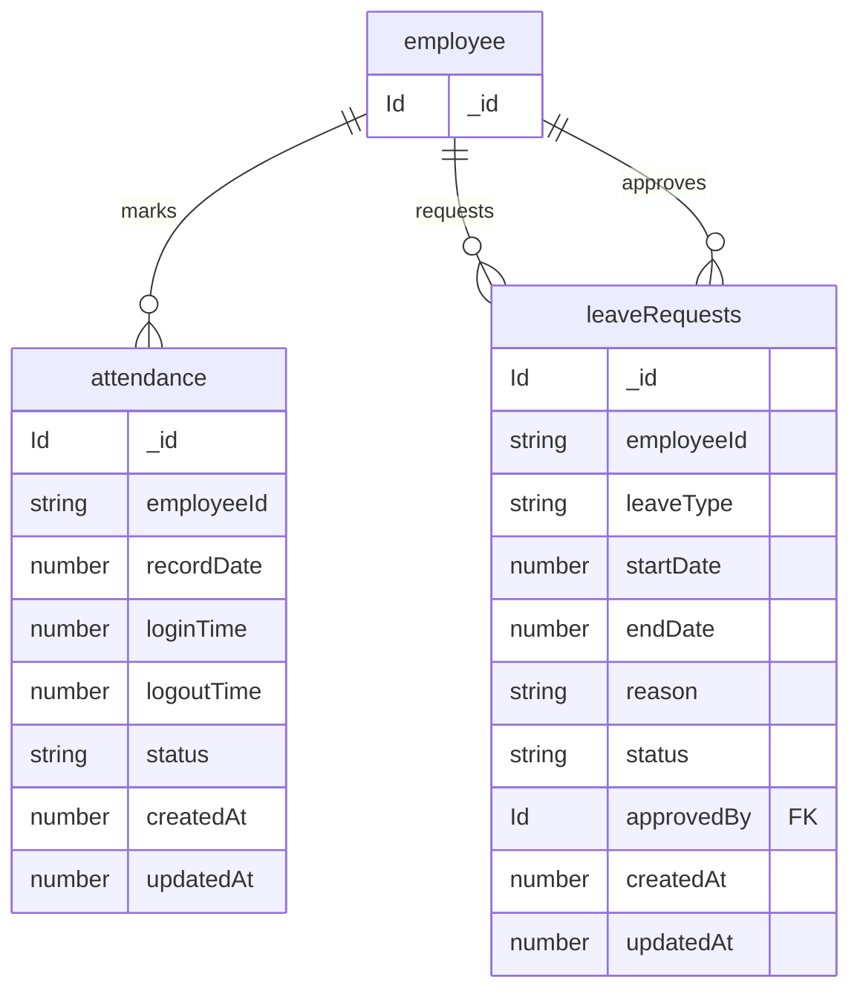

# Attendance Management data model

Source of truth: `convex/schema.ts`

These tables live in the root Convex application schema.

---

## Core Concept

- Attendance tracks daily employee presence and working hours.
- Leave requests manage employee absence requests with approval workflow.

## Attendance and Leave

---

## Field notes

### attendance.status values

- `present`
- `on leave`
- `late`
- `half day`

### attendance.status meanings

- `present` — Employee attended normally.
- `on leave` — Employee is on approved leave.
- `late` — Employee checked in late.
- `half day` — Employee worked partially for the day.

---

### leaveRequests.leaveType values

- `sick`
- `casual`
- `emergency`

### leaveRequests.status values

- `pending`
- `approved`
- `rejected`

### leaveRequests.status meanings

- `pending` — Waiting for approval.
- `approved` — Leave request accepted.
- `rejected` — Leave request denied.

---

## Optional fields

- `attendance.logoutTime` — Optional logout timestamp.
- `attendance.updatedAt` — Optional update timestamp.
- `leaveRequests.approvedBy` — Optional approver reference.
- `leaveRequests.updatedAt` — Optional update timestamp.

---

## Indexes

### attendance

- `by_employee_and_date`
- `by_employee`

### leaveRequests

- `by_employee`
- `by_status`
- `by_approved_by`