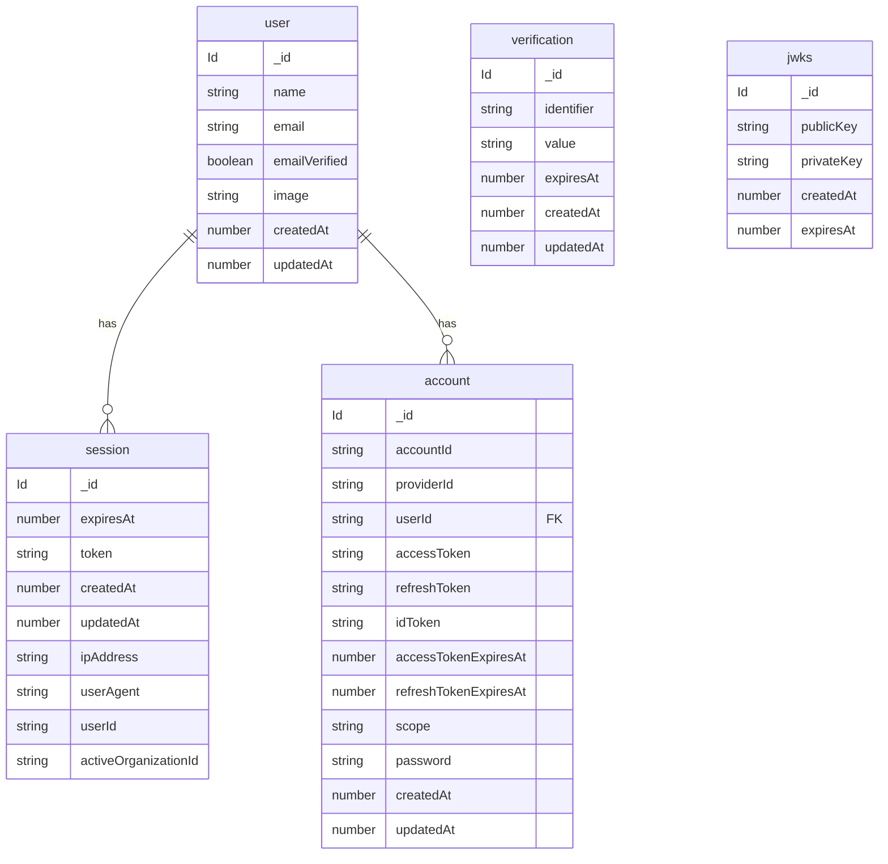
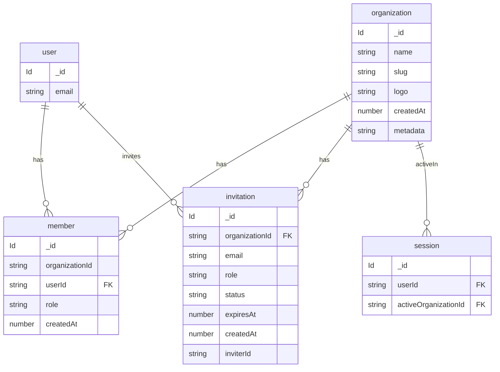

# Better Auth data model (Convex component)

Source of truth: [`convex/betterAuth/schema.ts`](../../../convex/betterAuth/schema.ts). Regenerate with:

`bun auth:generate`

These tables live in the **Better Auth Convex component** (`betterAuth`), not in the root app `schema.ts`. String fields like `userId` and `organizationId` reference document `_id` values from the corresponding tables.

Configured plugins (see [`convex/betterAuth/auth.ts`](../../../convex/betterAuth/auth.ts)): **Convex adapter**, **email/password**, **organization**.

---

## Core auth

---

## Organizations (`organization()` plugin)

---

## Field notes

- **`user`** — `image` and `userId` are optional (nullable in Convex validators).
- **`session`** — `ipAddress`, `userAgent`, and `activeOrganizationId` are optional.
- **`account`** — Provider tokens and `password` are optional; shape depends on provider (email/password vs OAuth).
- **`verification`** — No `userId`; flows use `identifier` + `value` + `expiresAt`.
- **`member`** — Membership is `(organizationId, userId, role)` plus timestamps.
- **`invitation`** — `inviterId` references `user`; `role` optional per validator.

Full indexes remain in `schema.ts` (for example `token`, `slug`, `email_name`).
