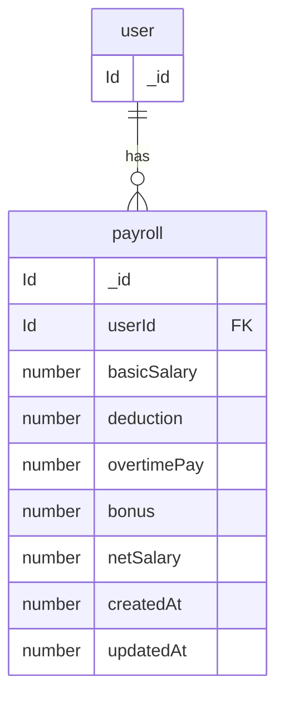

# Better Auth data model (Convex component)

Source of truth: [`convex/betterAuth/schema.ts`](../../../convex/betterAuth/schema.ts). Regenerate with:

`bun auth:generate`

These tables live in the **Better Auth Convex component** (`betterAuth`), not in the root app `schema.ts`. String fields like `userId` and `organizationId` reference document `_id` values from the corresponding tables.

Configured plugins (see [`convex/betterAuth/auth.ts`](../../../convex/betterAuth/auth.ts)): **Convex adapter**, **email/password**, **organization**.

---
## payroll

---
## Field notes
  
  *`user`* — core employee entity. Payroll records are generated and linked to users.
  *`payroll`* — stores salary breakdown for an employee for a given period. Includes earnings, deductions, and final     payable amount. 
  *`payroll.userId`* — references the employee receiving the salary.
  *`basicSalary`* — fixed monthly salary before any additions or deductions.  
  *`deduction`*   — total amount deducted (tax, penalty, insurance, etc.).
  *`overtimePay`* — additional earnings from extra working hours.
  *`bonus`*       — extra rewards or incentives added to salary. 
  *`netSalary`*   — final payable salary after calculations:basicSalary + overtimePay + bonus - deduction
  *`createdAt / updatedAt`* — timestamps used for payroll tracking and history.