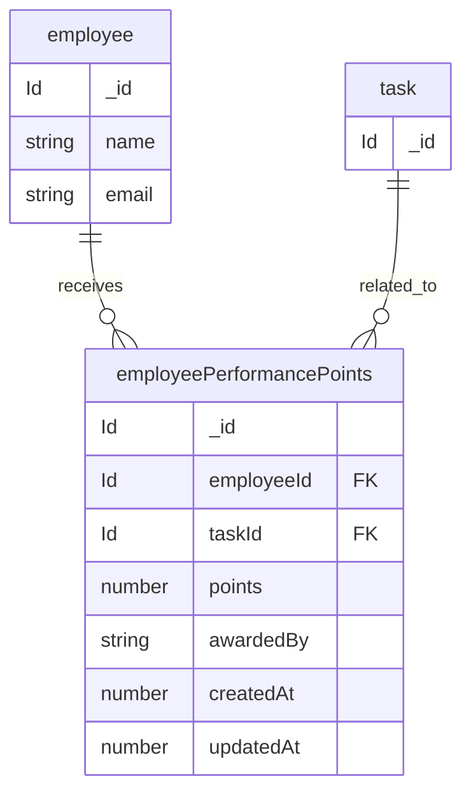

# Better Auth data model (Convex component)

Source of truth: [`convex/betterAuth/schema.ts`](../../../convex/betterAuth/schema.ts). Regenerate with:

`bun auth:generate`

These tables live in the **Better Auth Convex component** (`betterAuth`), not in the root app `schema.ts`. String fields like `userId` and `organizationId` reference document `_id` values from the corresponding tables.

Configured plugins (see [`convex/betterAuth/auth.ts`](../../../convex/betterAuth/auth.ts)): **Convex adapter**, **email/password**, **organization**.

---

## performance

## Final notes 

- `employee` — core entity representing employees in the organization. Employees can receive performance points based on work contributions and evaluations.

- `task` — reference entity representing assigned work items. Performance points may be linked to a related task.

- `employeePerformancePoints` — stores performance rewards, contribution scores, or evaluation points assigned to employees.

- `employeeId` — references the employee receiving the performance points.

- `taskId` — references the task associated with the awarded performance points.

- `awardedBy` — stores the identifier of the manager, admin, or team lead who awarded the points.

- `points` — numeric score representing employee performance contribution or achievement level.

- `updatedAt` — optional timestamp updated whenever the performance record is modified.

- `createdAt / updatedAt` — timestamps used for audit tracking and historical record management.

  