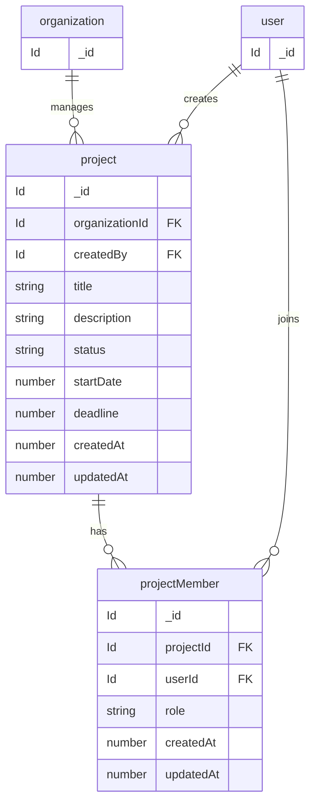

# Project Management data model

Source of truth: `convex/schema.ts`

These tables live in the root Convex application schema.

---

## Projects

## Field notes

### project.status values
- `todo`
- `in_progress`
- `completed`
- `cancelled`

### projectMember.role values
- `admin`
- `developer`
- `tester`
- `viewer`

---

## Field notes
  
  user — core entity representing system users. Used as project creator and project members.
  
  organization — top-level container for projects. All projects belong to one organization for multi-tenant isolation.

  project — main entity representing a work item or initiative. Created by a user and belongs to an organization. Tracks lifecycle, timeline, and status.
  
  project.status — defines project lifecycle:
       "todo" → not started
       "in_progress" → currently active
       "completed" → finished
       "cancelled" → stopped or discarded

  projectMember — junction table connecting users and projects. Defines team participation and role-based access.
  
  projectMember.role — defines responsibility level in a project:

     "admin" → full control over project
     "developer" → works on implementation
     "tester" → handles testing and QA

  createdBy — user who created the project. Used for ownership tracking.
  
  startDate / deadline — defines project timeline for scheduling and tracking progress.
  
  createdAt / updatedAt — timestamps used for audit and tracking changes.