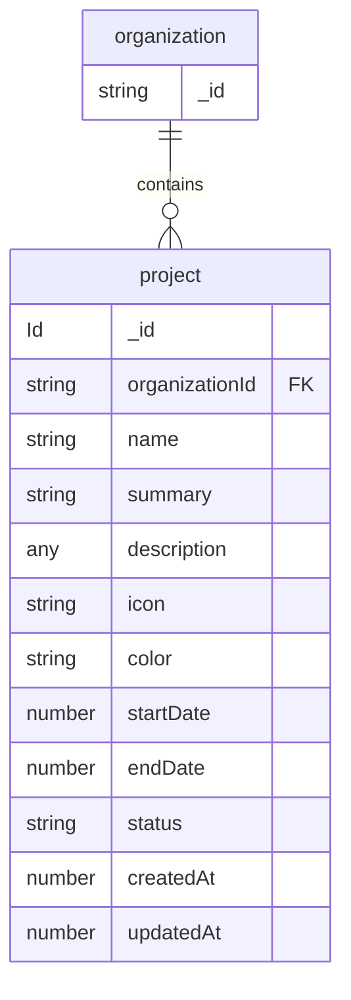

# Project Management data model

Source of truth: `convex/schema.ts`

These tables live in the root Convex application schema.

---

## Projects

## Field notes

  - **`organizationId`** — References the organization that owns the project. Used for multi-organization isolation.

  -**`name`** — Stores the project title or display name.

  - **`summary`** — Optional short overview or lightweight description of the project.

  - **`description`** — Optional collaborative rich-text editor content stored as structured JSON data.

  - **`icon`** — Optional emoji or icon representation used for project appearance customization.

  - **`color`** — Optional UI theme color associated with the project icon and appearance.

  - **`status`** — Defines the current lifecycle state of the project.

### `project.status` values

   - `active`
   - `inactive`
   - `terminated`

### `project.status` meanings

   - `active` — Project is currently running.

   - `inactive` — Project is temporarily paused.

   -  `terminated` — Project has been permanently stopped.

- **`startDate / endDate`** — Defines the project schedule and duration.

- **`createdAt`** — Timestamp indicating when the project was created.

- **`updatedAt`** — Optional timestamp indicating the most recent project update.

- **Optional fields** — `summary`, `description`, `icon`, `color`, and `updatedAt` are optional fields and may contain `undefined` values depending on project configuration or updates.

-**Indexes** — Projects are indexed using `by_organization` for efficient organization-based project queries.
