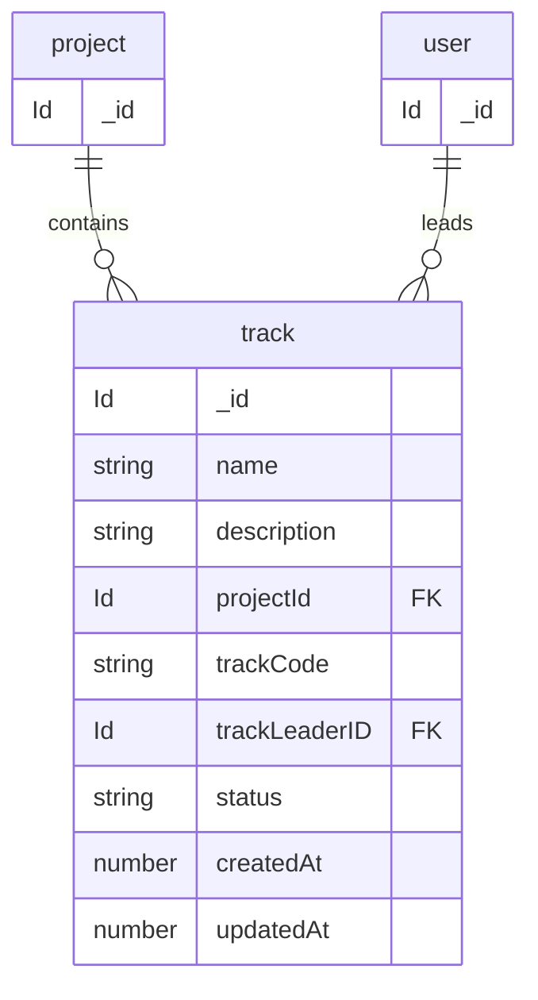

# track Management data model

Source of truth: `convex/schema.ts`

These tables live in the root Convex application schema.

---

Core Concept

A project can have multiple tracks.

Tracks are used to:

organize work into separate areas
split large projects into manageable sections
represent teams, modules, or feature groups

## track

## Field notes

* **`track`** — Represents a subdivision or workflow unit inside a project. Used to organize tasks, teams, or development flows.

* **`name`** — Stores the track title or display name.

* **`description`** — Optional detailed explanation or overview of the track.

* **`projectId`** — References the project to which the track belongs.

* **`trackCode`** — Unique identifier/code used to distinguish tracks within a project.

* **`trackLeaderID`** — Stores the identifier of the user responsible for managing or leading the track.

* **`status`** — Defines the current lifecycle state of the track.

### `track.status` values

* `active`
* `completed`
* `archived`

### `track.status` meanings

* `active` — Track is currently in progress.

* `completed` — Track work has been finished.

* `archived` — Track is no longer active and kept for historical/reference purposes.

* **`createdAt`** — Timestamp indicating when the track was created.

* **`updatedAt`** — Optional timestamp indicating the most recent track update.

* **Optional fields** — `description` and `updatedAt` are optional fields and may contain `undefined` values.

* **Indexes** — Tracks are indexed using `by_project` for efficient project-based track queries.
